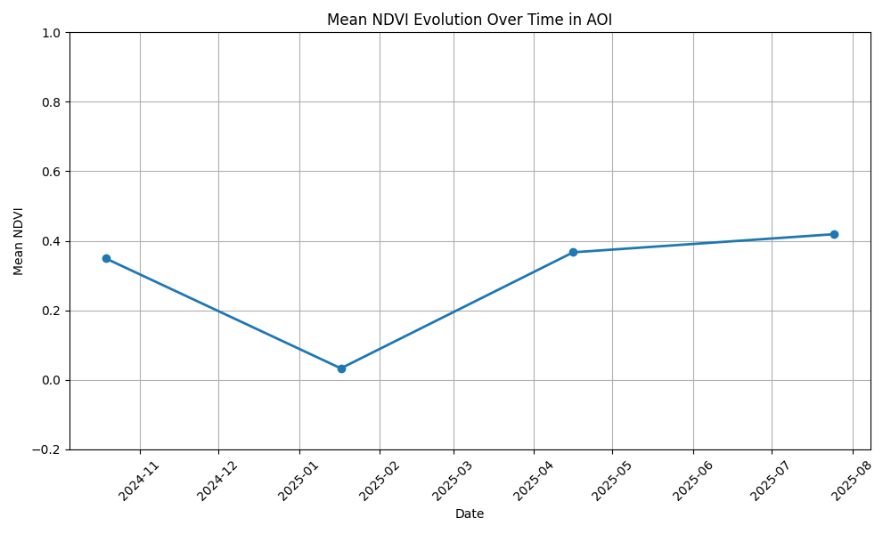

# ndvi_exploration

Coded a python script to explore changes in ndvi from satellite imagery data from Sentinel-2 Copernicus website.

The satellite imagery files are not included due to the size. But they are easy to download from Copernicus website. To use the script, the only thing you would need to do is to replace the .SAFE files with your owns.
Also, it is possible to use Copernicus API. I did not as this was meant to be a POC

